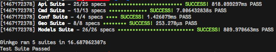

Notes
-----

I chose **sqlite3** as my datastore for the sake of simplicity and
portability.  I chose **gin** as my router because I've used it before.  It is
fast, really simple, and uses a 0-allocation router. I used **ginkgo**
& **gomega** for testing because I like the easily nested structures that BDD
frameworks give.  I used **gorm** for the in-app database access because
it makes common tasks really easy. For the data loading and for any
complicated queries I just used raw SQL. I chose **toml** for a config
file format because it's quick and simple and I like to have a command
line option to generate a default config file. No package management.

Run it
------

### Setup

    go get ./...

### Test

    ginkgo -r

### Build

    go build

### Generate your config file

    ./RestApiProject generate-config > config.toml

### Run the server

    ./RestApiProject api-server

Bonus points
------------

These features are accounted for in partial implementations, but not
actually implemented. I chose to focus my time on building thorough tests.

### Authenticate users

For full success it would need:

-   an authentication middleware which would check for *either* a username
    and password combo or a valid auth token.
-   a create user endpoint
-   a change password endpoint
-   a user token retreival endpoint. This would take username and
    password, verify the hash (already implemented using bcrypt), and
    return a time-limited JWT token, cryptographically signed with
    asynchronous keys

### Coordinates

My intent here was to eventually allow users to "visit" merely by posting
their current coordinates. The haversine formula can be used to find
nerest points or every point within a radius.  The only problem is that
sqlite doesn't have mathematical functions.  So I pre-calculate the sin
and cos for each lat and lon.  Using trigonometric identities and some
algebra, it should be possible to query the database directly.
